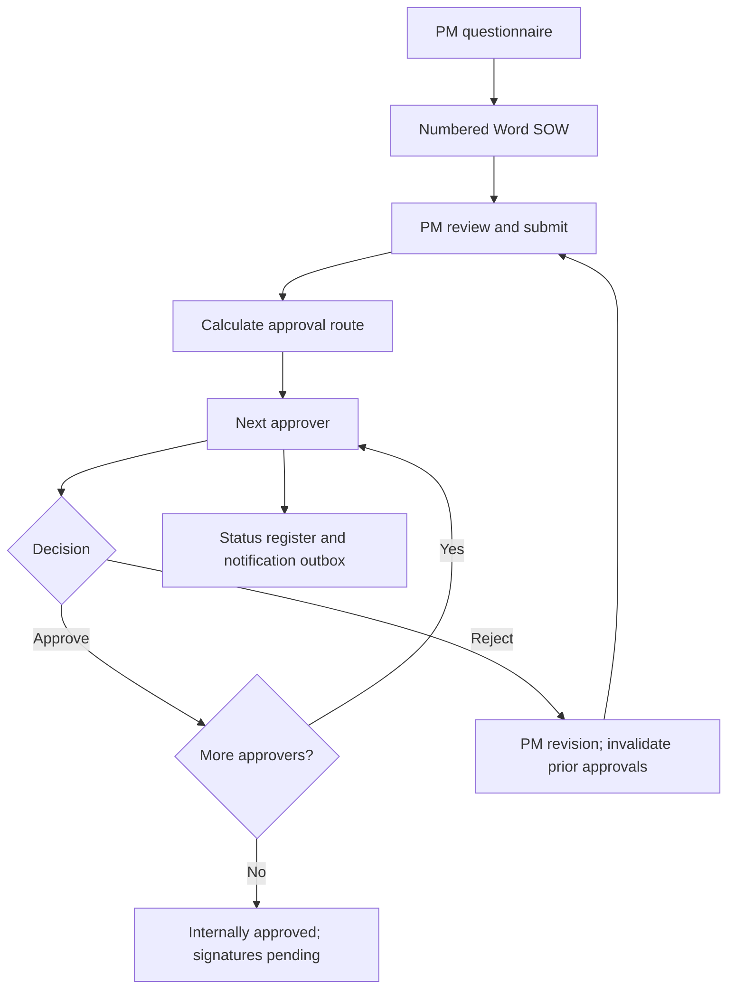

# SOW Flow — SOW generation and sequential approvals

**Eran Bloom | Business Operations & Automation**

A local, runnable portfolio reconstruction of the SOW workflow designed and implemented by Eran Bloom. Structured PM intake becomes a numbered Word document, then moves through PM review and risk-based sequential approvals.

Original tenant access, SharePoint lists and exported flows are unavailable. This new demo uses synthetic data and AI-assisted code. It is not a Microsoft solution export and contains no former-employer data. The workflow is deterministic; there is no live AI model in this reconstruction.

[View all my automation projects](https://github.com/eranbloom-builder) · [ActionFlow: action collection and follow-up](https://github.com/eranbloom-builder/actionflow-ai-operations)

[Preview the final approved sample PDF](sample-sow.pdf)

## Start here

Extract the ZIP and open **standalone-demo.html** in a desktop browser. No installation, Microsoft account, API key or Internet connection is required. The demo is best reviewed on a computer. If your phone only shows an HTML preview, use a desktop browser for the interactive controls.

### Five-minute walkthrough

1. The sample starts at CAD 75,000. Check the questionnaire and click **Generate new SOW**.
2. Inspect the generated document and download the real Word `.docx`. Confirm requirements, scope, quantity, milestones, success criteria, focal points and signature spaces.
3. Click **PM confirms document review**, then **Submit for approval**. Inspect the PM and Contract Manager notification previews.
4. Approve as Contract Manager. Finance Director becomes next. Approve as Finance Director to complete internal approval. The final PDF downloads automatically; the document button switches from draft Word to final PDF.
5. Generate another SOW at 25,000 to see one approver. Generate one at 125,000 to see four. At a low amount, select Hardware and describe it; this also requires all four approvers.
6. On a submitted four-role SOW, approve the first role, then enter a rejection reason and reject as Finance Director. Edit the questionnaire, click **Save revision of selected SOW**, review again and resubmit. Contract Manager is first again; old history remains.
7. Select records in the register and export its JSON. Generated SOWs are separate from current form edits; explicitly save a revision to incorporate edits.

Travel is now an explicit Yes/No intake question. If Yes, travel details and estimated expenses are required. Travel alone does not escalate the approval route; amount and existing risk flags control routing.

## Document layout

The generated Word document and browser preview use an adapted E1–E6 layout, with serif typography, numbered headings, a six-column delivery work-breakdown table and vendor/customer signature spaces. Word and final PDF include document identification and page numbers in their footers. Drafts download as Word; the fully approved revision downloads as PDF. The PDF uses the same numbered layout, serif typography, delivery table and signatures. Exact pagination can vary with content and font metrics. PDFs use standard Times fonts; characters outside the supported Western character set are substituted.

Design reference supplied by the user: Health Canada's sample SOW at https://www.canada.ca/content/dam/hc-sc/migration/hc-sc/dhp-mps/alt_formats/hpfb-dgpsa/pdf/prodpharma/erci_sow_iace_edt-eng.pdf . The structure is adapted to a generic commercial engagement. Government branding, specialized medical requirements and government-specific contractual provisions are not reproduced. This is not a Health Canada document or endorsement.

Expand **Additional SOW sections (optional)** to fill in context, budget assumptions, reporting, environment, responsibilities, location, language, resources and reference materials. Missing optional information is identified for PM confirmation. Per-milestone effort and payment allocations are not inferred from total effort or value. The table preserves the submitted milestones and identifies missing allocations.

## Approval matrix

| Condition | Sequential route |
|---|---|
| Amount below 50,000 and no dependency flags | Contract Manager |
| 50,000–100,000 inclusive and no dependency flags | Contract Manager → Finance Director |
| Above 100,000 OR third party / additional vendor / hardware / software | Contract Manager → Finance Director → Legal Counsel → Delivery Prime |

This demo treats additional vendor as a third-party risk trigger and uses the selected currency without conversion. Production requires agreed threshold currency and exchange-rate rules. Amount means total SOW value; the ambiguous intake item “amount of” is represented as quantity / effort plus a separate total amount.

Each submission notifies the PM and first approver. Each intermediate approval notifies the PM and next approver. Final approval notifies the PM. Rejection notifies the PM, halts the current attempt and requires revision and renewed PM review before a fresh sequence. Approval is internal authorization, not legal execution or electronic signature.

## What works and what is simulated

| Capability | Demo | Original workflow described |
|---|---|---|
| Questionnaire | Editable validated browser form | Structured PM questionnaire |
| Numbering | Local monotonic SOW sequence; revisions retain ID | Generated sequential SOW number |
| Word document | Actual OOXML `.docx` download | Populated Word template |
| PM review | Explicit review gate | PM reviews and submits |
| Routing | Executable business rules | Automated approval routing |
| Approval decisions | Simulated next-role buttons, sequential state machine | Individual sequential approvers |
| Notifications | Inspectable outbox previews; no messages sent | Emails to PM and next approver |
| Tracking | Browser storage and JSON export | SharePoint register |
| Rejection | Preserved history and full approval restart | Process restarts after rejection |

Browser-local storage is single-user and may be unavailable for local files in some browsers. If available, it persists across refreshes in that browser; clearing browser data loses the sequence and records. An exported register is a review snapshot, not an import/restore feature. Numbering is not globally unique or concurrency-safe. The role buttons illustrate behavior and do not authenticate approvers. No background email delivery, SharePoint connection, e-signature, live AI or production access control is included.

## Design and business value

Structured intake reduces incomplete drafting. Deterministic routing applies consistent governance to value and dependencies. Sequential ownership makes the next decision visible, while PM notifications and a retained audit history reduce manual status chasing. These are intended design benefits; no measured savings or historical outcome claims are made.

## Source and verification

- `core.js`: validation, routing, approval state, audit history, email payloads and Word package writer.
- `pdf.js`, `vendor/pdf-lib.min.js`: offline final approved PDF generation.
- `app.js`, `template.html`: local interactive interface.
- `standalone-demo.html`: bundled double-click demo.
- `sample.json`: synthetic project data.
- `tests/core.test.cjs`: approval boundaries, risk overrides, PM gate, sequence enforcement, rejection and restart.
- `docs/microsoft-rebuild.md`: suggested Microsoft implementation.

With Node.js 20+: run `npm test`. Run `node build.cjs` after source changes to rebuild the single-file demo. Run `node cli.cjs` to generate `sample-sow.docx` without the UI. No package installation is required; the MIT-licensed pdf-lib browser library is bundled in `vendor/` for offline PDF generation.

Generic document clauses are demonstration placeholders and require legal review before use. They do not replace a reviewed customer or vendor contract.

Attribution: workflow concept and original implementation by Eran Bloom; this reconstructed code and documentation created with AI coding assistance.
